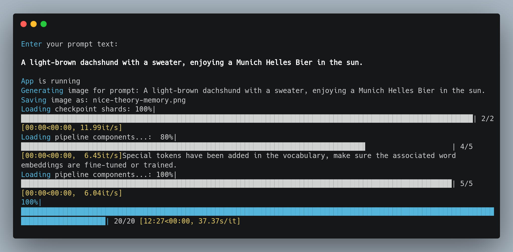

# Generative AI - Image
## Creates images from users free text input

<!--
*** Written by Martin Karlsson
*** www.martinkarlsson.io
-->

[![LinkedIn][linkedin-shield]][linkedin-url]

<!-- ABOUT THE PROJECT -->
## About The Project

Intention with this project is to create a solution that can generate images from users free text input. The solution should be ready to use without any struggle for the user.  
The container will ask for input, and then store the generated output under a shared folder "output" in the same directory as the user started the container from.

##### Docker Image
https://hub.docker.com/r/martinkarlssonio/genai-image

##### Tech Stack
The container images is built around PyTorch [ https://pytorch.org ] and Hugging Face [ https://huggingface.co ]

##### Model
pixArt-alpha/pixArt-XL-2-1024-MS [ https://huggingface.co/PixArt-alpha/PixArt-XL-2-1024-MS ]

#### Execution and Input

#### Output

## Pre-requisite
- Only confirmed working on Linux/Windows.
- Ensure Docker is installed.

## Start

Execute `bash runLinux.sh` alternative `./runWindows.ps1` to start the container.
You will be requested to provide the prompt input.

<!-- CONTACT -->
## Contact

### Martin Karlsson

LinkedIn : [martin-karlsson][linkedin-url] \
Twitter : [@HelloKarlsson](https://twitter.com/HelloKarlsson) \
Email : hello@martinkarlsson.io \
Webpage : [www.martinkarlsson.io](https://www.martinkarlsson.io)

Project Link: [github.com/martinkarlssonio/big-data-solution](https://github.com/martinkarlssonio/big-data-solution)

<!-- MARKDOWN LINKS & IMAGES -->
[linkedin-shield]: https://img.shields.io/badge/-LinkedIn-black.svg?style=for-the-badge&logo=linkedin&colorB=555
[linkedin-url]: https://linkedin.com/in/martin-karlsson